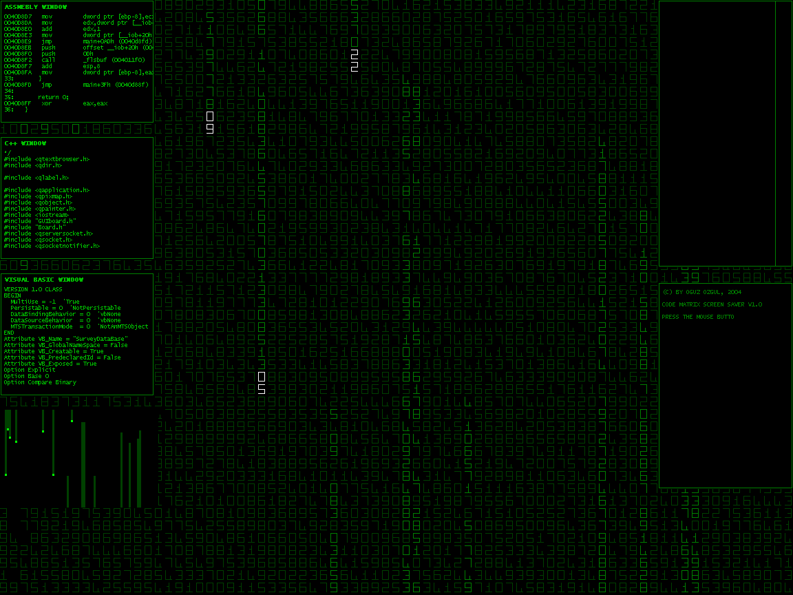



## Code\-Rix

### Description

Code-Rix is a nice matrix screen saver, gives a multi-threaded application feeling since 6 windows and the main background all run together

Waiting for someone to convert it to a real screen saver, I don't have much time
 
### More Info
 

             |
---                |---
**Submitted On**   |2004-12-27 00:24:44
**By**             |[OGUZ\_OZGUL](https://github.com/Planet-Source-Code/PSCIndex/blob/master/ByAuthor/oguz-ozgul.md)
**Level**          |Advanced
**User Rating**    |5.0 (30 globes from 6 users)
**Compatibility**  |VB 5\.0, VB 6\.0
**Category**       |[Graphics](https://github.com/Planet-Source-Code/PSCIndex/blob/master/ByCategory/graphics__1-46.md)
**World**          |[Visual Basic](https://github.com/Planet-Source-Code/PSCIndex/blob/master/ByWorld/visual-basic.md)
**Archive File**   |[Code\-Rix183705162005\.zip](https://github.com/Planet-Source-Code/oguz-ozgul-code-rix__1-58124/archive/master.zip)

